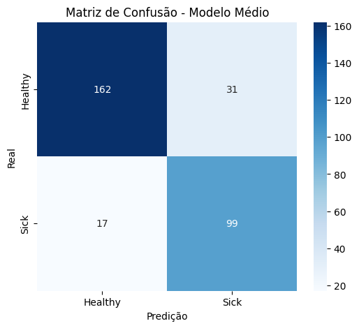
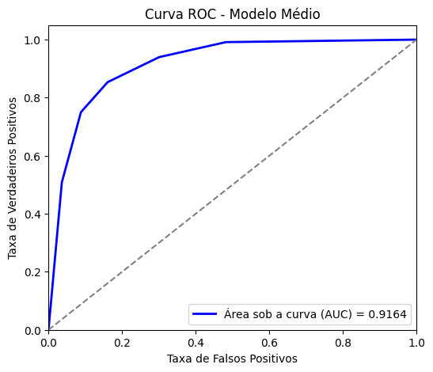
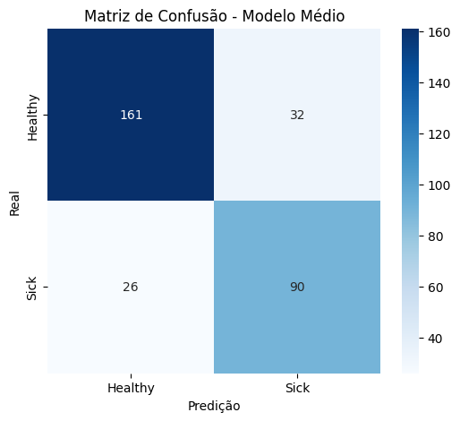
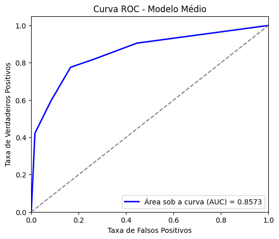
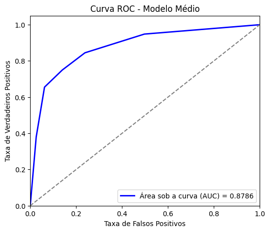
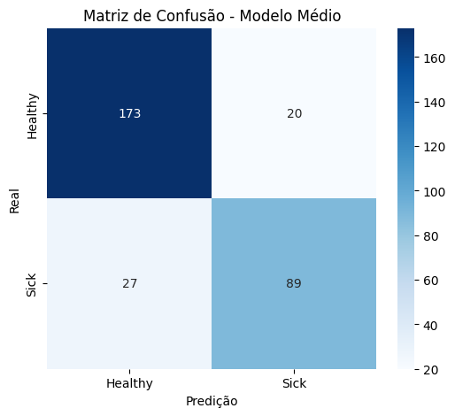
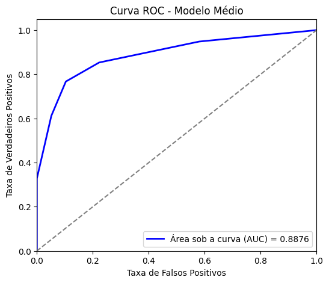
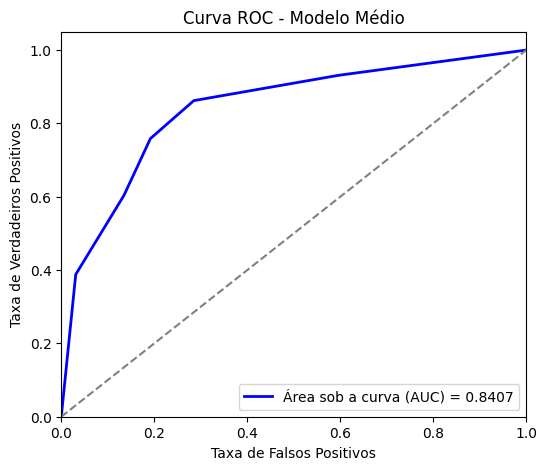

# Experimento 1
===== 📊 MÉTRICAS DO MODELO MÉDIO =====
- ✅ Accuracy: 0.8447
- ✅ Sensitivity (Recall): 0.8534
- ✅ Specificity: 0.8394
- ✅ Precision: 0.7615
- ✅ F1-score: 0.8049

# Experimento 2

===== 📊 MÉTRICAS DO MODELO MÉDIO =====
✅ Accuracy: 0.8123
✅ Sensitivity (Recall): 0.7759
✅ Specificity: 0.8342
✅ Precision: 0.7377
✅ F1-score: 0.7563

# Experimento 3
===== 📊 MÉTRICAS DO MODELO MÉDIO =====
✅ Accuracy: 0.8188
✅ Sensitivity (Recall): 0.7500
✅ Specificity: 0.8601
✅ Precision: 0.7632
✅ F1-score: 0.7565

# Experimento 4
===== 📊 MÉTRICAS DO MODELO MÉDIO =====
✅ Accuracy: 0.8479
✅ Sensitivity (Recall): 0.7672
✅ Specificity: 0.8964
✅ Precision: 0.8165
✅ F1-score: 0.7911

# Experimento 5

===== 📊 MÉTRICAS DO MODELO MÉDIO =====
✅ Accuracy: 0.7896
✅ Sensitivity (Recall): 0.7586
✅ Specificity: 0.8083
✅ Precision: 0.7040
✅ F1-score: 0.7303

