# Experimentos:
- learning rate 0,001
- A =  modelo sem modificações
- B = 2 FC com 256 neurônios como saída da primeira e entrada na segunda 
- C = 2 FC (512, 2); 
- D = 2 FC (1024, 2); 
- E = 3 FC (4096, 1024, 2);
- 2 = learning rate 0,0001

# Experimento A
===== 📊 MÉTRICAS DO MODELO MÉDIO =====
- ✅ Accuracy: 0.7600
- ✅ Sensitivity (Recall): 0.6920
- ✅ Specificity: 0.8280
- ✅ Precision: 0.8009
- ✅ F1-score: 0.7425

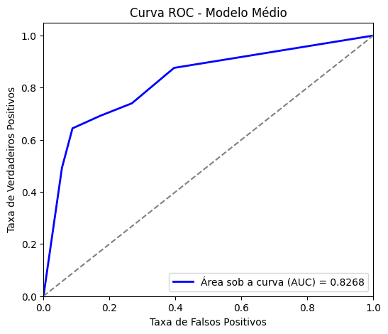

# Experimento A2
===== 📊 MÉTRICAS DO MODELO MÉDIO =====
- ✅ Accuracy: 0.8120
- ✅ Sensitivity (Recall): 0.6920
- ✅ Specificity: 0.9320
- ✅ Precision: 0.9105
- ✅ F1-score: 0.7864

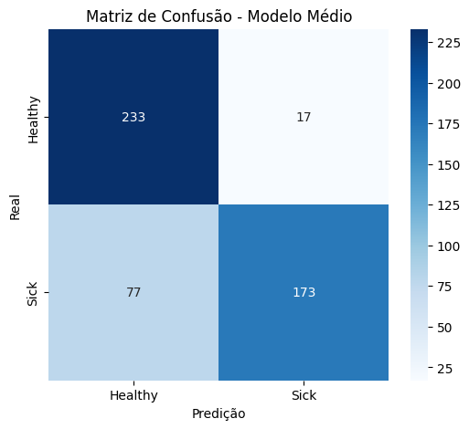
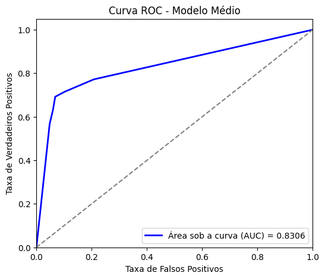

# Experimento B
===== 📊 MÉTRICAS DO MODELO MÉDIO =====
✅ Accuracy: 0.8080
✅ Sensitivity (Recall): 0.7760
✅ Specificity: 0.8400
✅ Precision: 0.8291
✅ F1-score: 0.8017

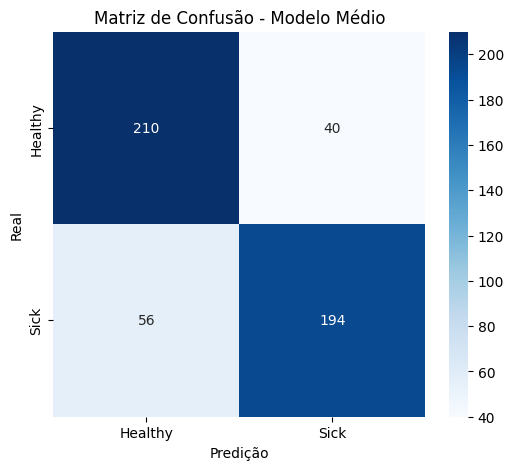
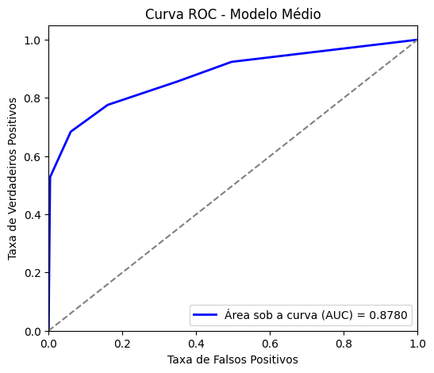

# Experimento B2
===== 📊 MÉTRICAS DO MODELO MÉDIO =====
✅ Accuracy: 0.7780
✅ Sensitivity (Recall): 0.6960
✅ Specificity: 0.8600
✅ Precision: 0.8325
✅ F1-score: 0.7582

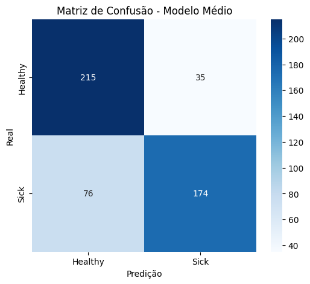
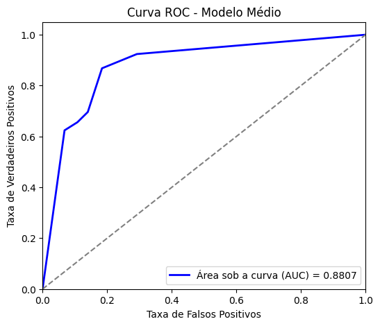

# Experimento C
===== 📊 MÉTRICAS DO MODELO MÉDIO =====
- ✅ Accuracy: 0.8060
- ✅ Sensitivity (Recall): 0.8640
- ✅ Specificity: 0.7480
- ✅ Precision: 0.7742
- ✅ F1-score: 0.8166

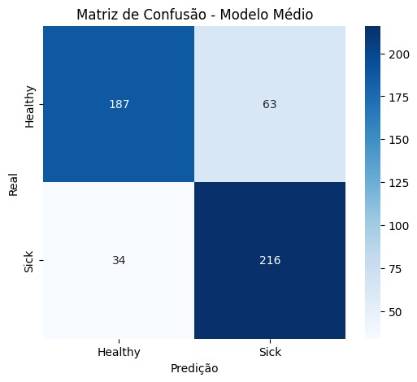
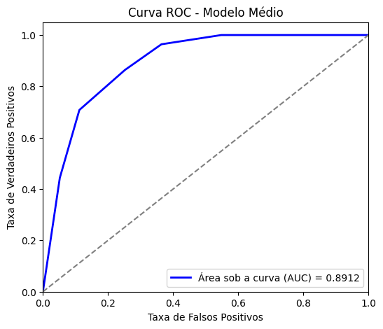

# Experimento C2
===== 📊 MÉTRICAS DO MODELO MÉDIO =====
- ✅ Accuracy: 0.7700
- ✅ Sensitivity (Recall): 0.6680
- ✅ Specificity: 0.8720
- ✅ Precision: 0.8392
- ✅ F1-score: 0.7439

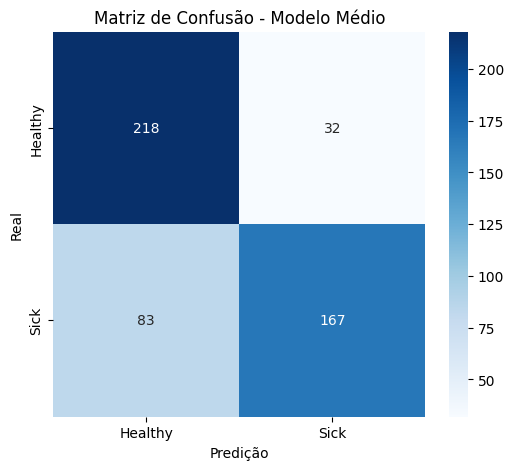
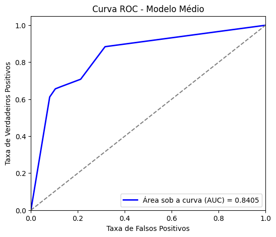

# Experimento D
===== 📊 MÉTRICAS DO MODELO MÉDIO =====
- ✅ Accuracy: 0.7720
- ✅ Sensitivity (Recall): 0.7880
- ✅ Specificity: 0.7560
- ✅ Precision: 0.7636
- ✅ F1-score: 0.7756

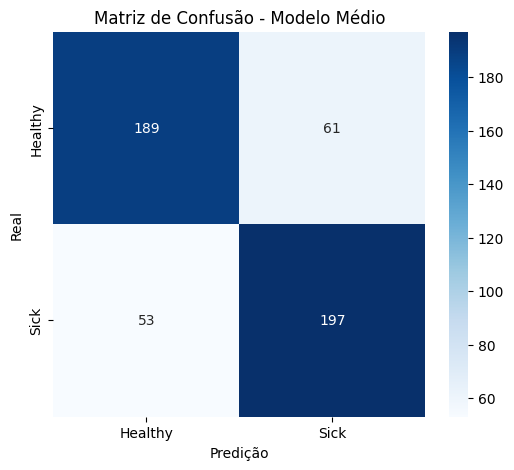
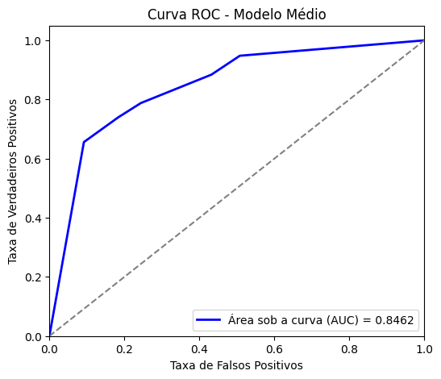

# Experimento D2
===== 📊 MÉTRICAS DO MODELO MÉDIO =====
- ✅ Accuracy: 0.7720
- ✅ Sensitivity (Recall): 0.6280
- ✅ Specificity: 0.9160
- ✅ Precision: 0.8820
- ✅ F1-score: 0.7336

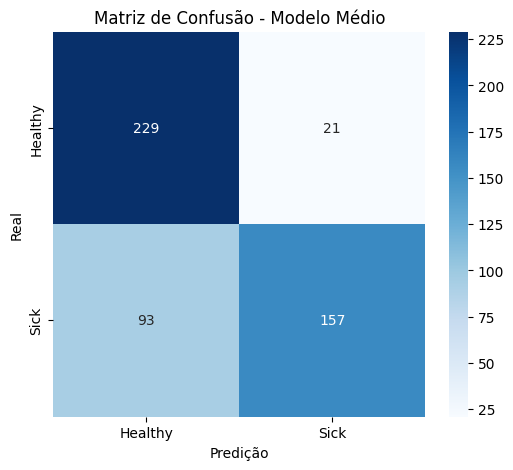
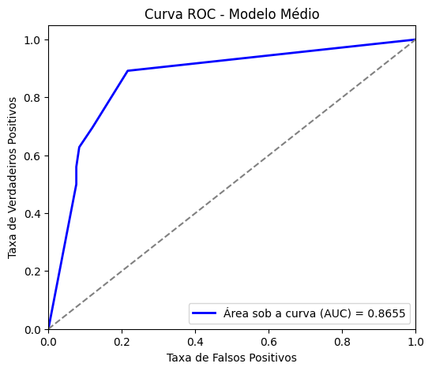

# Experimento E
===== 📊 MÉTRICAS DO MODELO MÉDIO =====
- ✅ Accuracy: 0.7860
- ✅ Sensitivity (Recall): 0.6960
- ✅ Specificity: 0.8760
- ✅ Precision: 0.8488
- ✅ F1-score: 0.7648

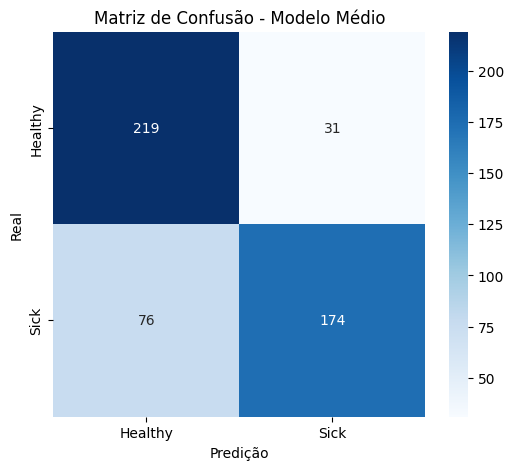
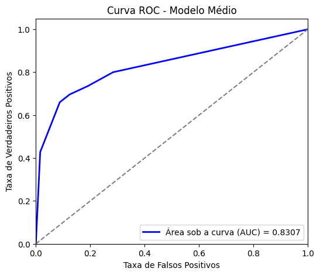

# Experimento E2 MELHOR
===== 📊 MÉTRICAS DO MODELO MÉDIO =====
- ✅ Accuracy: 0.8260
- ✅ Sensitivity (Recall): 0.7960
- ✅ Specificity: 0.8560
- ✅ Precision: 0.8468
- ✅ F1-score: 0.8206

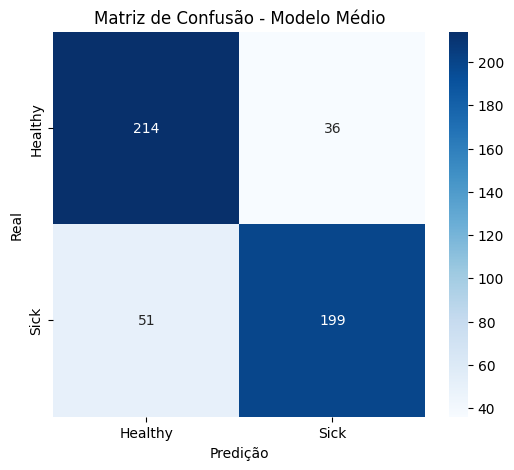
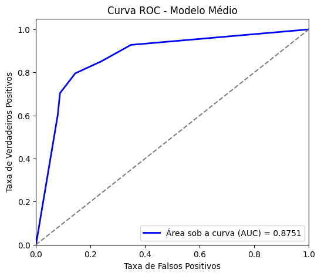