# Experimentos:
- learning rate 0,001
- A =  modelo sem modificações
- B = 2 FC com 256 neurônios como saída da primeira e entrada na segunda 
- C = 2 FC (512, 2); 
- D = 2 FC (1024, 2); 
- E = 3 FC (4096, 1024, 2);
- 2 = learning rate 0,0001

# Experimento A
===== 📊 MÉTRICAS DO MODELO MÉDIO =====
- ✅ Accuracy: 0.8000
- ✅ Sensitivity (Recall): 0.7000
- ✅ Specificity: 0.9000
- ✅ Precision: 0.8750
- ✅ F1-score: 0.7778

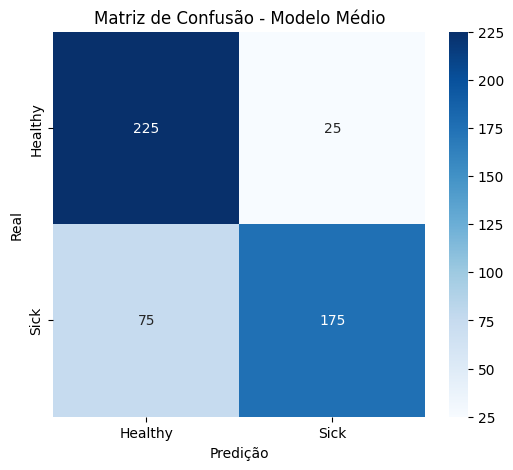
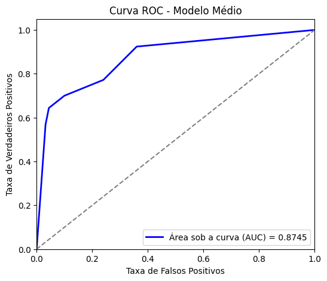

# Experimento A2
===== 📊 MÉTRICAS DO MODELO MÉDIO =====
- ✅ Accuracy: 0.8080
- ✅ Sensitivity (Recall): 0.6920
- ✅ Specificity: 0.9240
- ✅ Precision: 0.9010
- ✅ F1-score: 0.7828

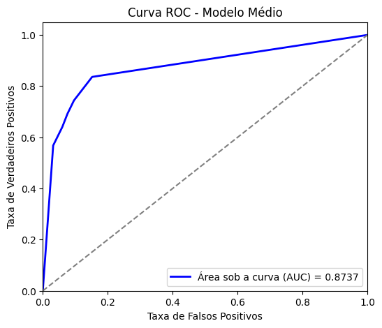

# Experimento B
===== 📊 MÉTRICAS DO MODELO MÉDIO =====
- ✅ Accuracy: 0.8160
- ✅ Sensitivity (Recall): 0.7080
- ✅ Specificity: 0.9240
- ✅ Precision: 0.9031
- ✅ F1-score: 0.7937

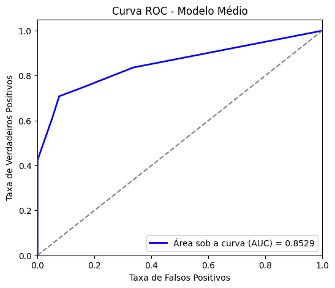

# Experimento B2
===== 📊 MÉTRICAS DO MODELO MÉDIO =====
- ✅ Accuracy: 0.8060
- ✅ Sensitivity (Recall): 0.6960
- ✅ Specificity: 0.9160
- ✅ Precision: 0.8923
- ✅ F1-score: 0.7820

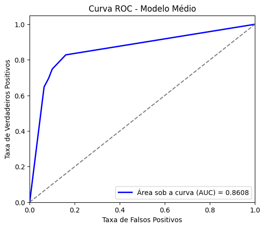

# Experimento C MELHOR
===== 📊 MÉTRICAS DO MODELO MÉDIO =====
- ✅ Accuracy: 0.8140
- ✅ Sensitivity (Recall): 0.7240
- ✅ Specificity: 0.9040
- ✅ Precision: 0.8829
- ✅ F1-score: 0.7956

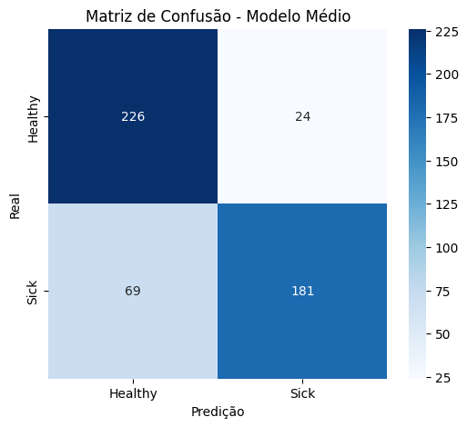
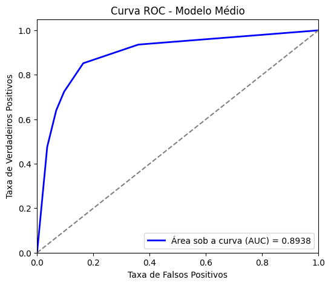

# Experimento D
===== 📊 MÉTRICAS DO MODELO MÉDIO =====
- ✅ Accuracy: 0.7940
- ✅ Sensitivity (Recall): 0.6920
- ✅ Specificity: 0.8960
- ✅ Precision: 0.8693
- ✅ F1-score: 0.7706

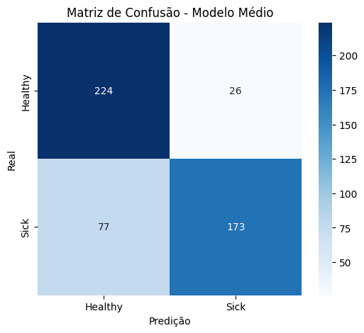
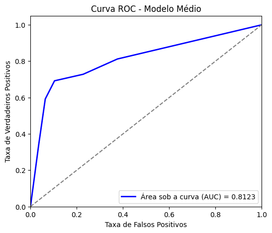

# Experimento E
===== 📊 MÉTRICAS DO MODELO MÉDIO =====
- ✅ Accuracy: 0.7920
- ✅ Sensitivity (Recall): 0.6840
- ✅ Specificity: 0.9000
- ✅ Precision: 0.8724
- ✅ F1-score: 0.7668

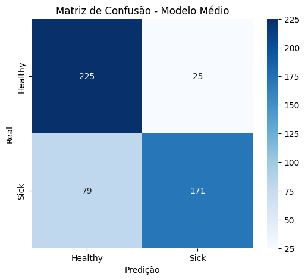
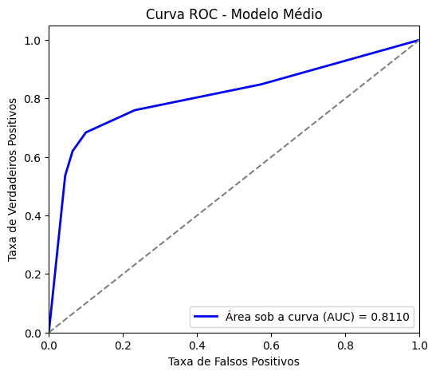