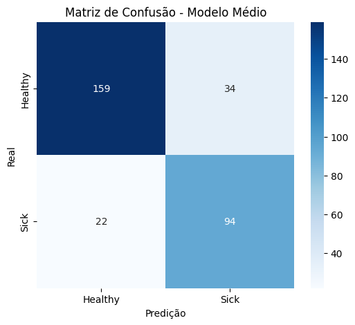
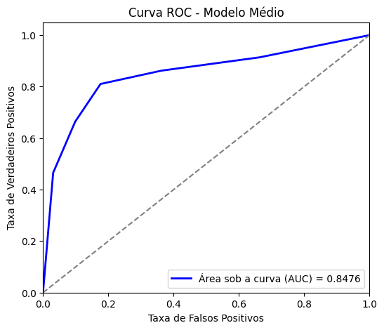
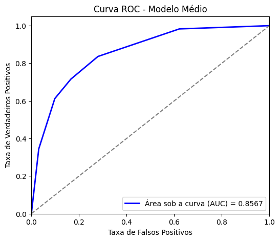
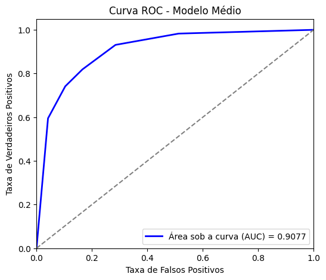
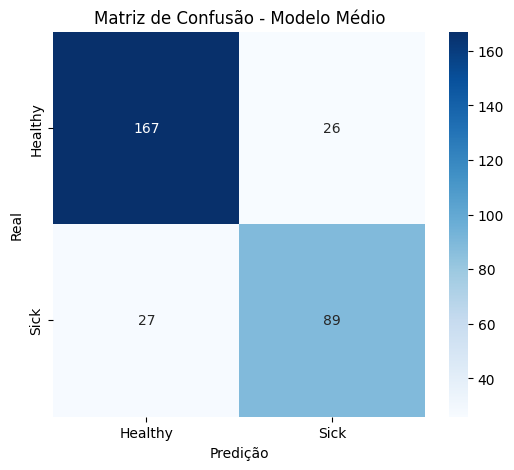
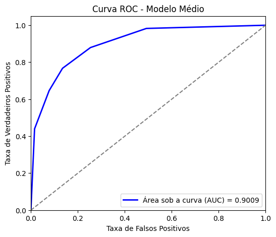
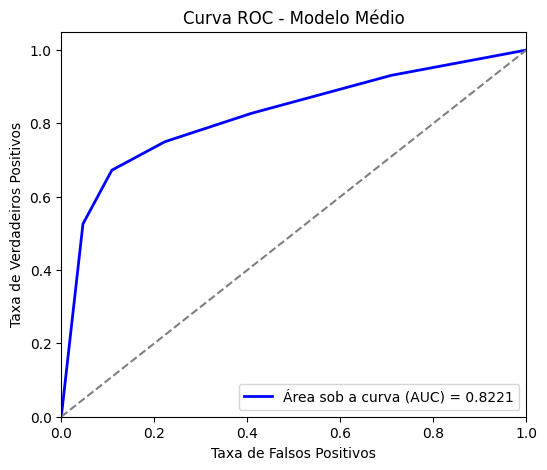

# Experimento 1
===== 📊 MÉTRICAS DO MODELO MÉDIO =====
- ✅ Accuracy: 0.8188
- ✅ Sensitivity (Recall): 0.8103
- ✅ Specificity: 0.8238
- ✅ Precision: 0.7344
- ✅ F1-score: 0.7705

# Experimento 2
===== 📊 MÉTRICAS DO MODELO MÉDIO =====
- ✅ Accuracy: 0.7896
- ✅ Sensitivity (Recall): 0.7155
- ✅ Specificity: 0.8342
- ✅ Precision: 0.7217
- ✅ F1-score: 0.7186

# Experimento 3

===== 📊 MÉTRICAS DO MODELO MÉDIO =====
- ✅ Accuracy: 0.8285
- ✅ Sensitivity (Recall): 0.8190
- ✅ Specificity: 0.8342
- ✅ Precision: 0.7480
- ✅ F1-score: 0.7819

# Experimento 4
===== 📊 MÉTRICAS DO MODELO MÉDIO =====
- ✅ Accuracy: 0.8285
- ✅ Sensitivity (Recall): 0.7672
- ✅ Specificity: 0.8653
- ✅ Precision: 0.7739
- ✅ F1-score: 0.7706

===== 📊 MÉTRICAS DO MODELO MÉDIO =====
- ✅ Accuracy: 0.7670
- ✅ Sensitivity (Recall): 0.7500
- ✅ Specificity: 0.7772
- ✅ Precision: 0.6692
- ✅ F1-score: 0.7073

