# Experimento A
===== 📊 MÉTRICAS DO MODELO MÉDIO =====
- ✅ Accuracy: 0.7700
- ✅ Sensitivity (Recall): 0.7040
- ✅ Specificity: 0.8360
- ✅ Precision: 0.8111
- ✅ F1-score: 0.7537

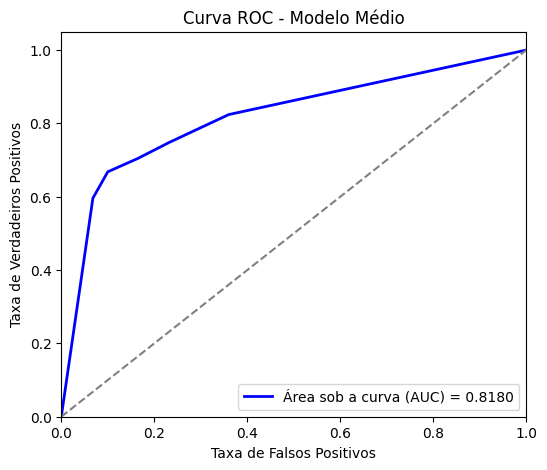

# Experimento A2
===== 📊 MÉTRICAS DO MODELO MÉDIO =====
- ✅ Accuracy: 0.8260
- ✅ Sensitivity (Recall): 0.7520
- ✅ Specificity: 0.9000
- ✅ Precision: 0.8826
- ✅ F1-score: 0.8121

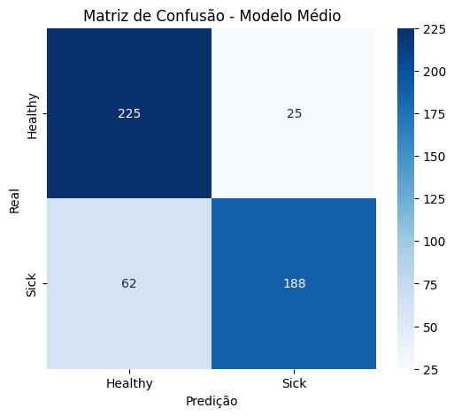
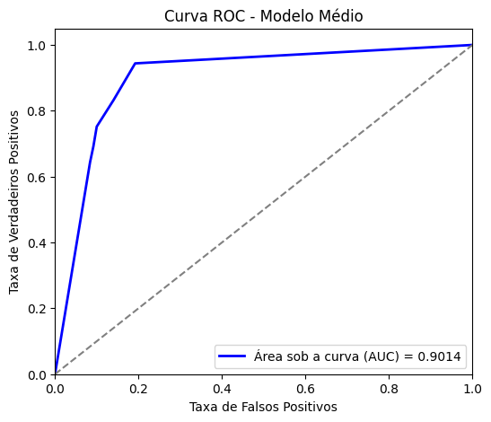

# Experimento B
===== 📊 MÉTRICAS DO MODELO MÉDIO =====
- ✅ Accuracy: 0.7800
- ✅ Sensitivity (Recall): 0.6520
- ✅ Specificity: 0.9080
- ✅ Precision: 0.8763
- ✅ F1-score: 0.7477

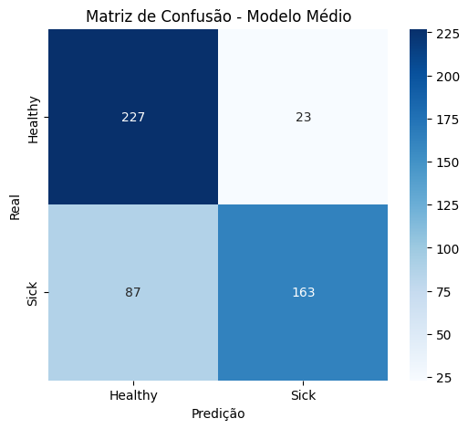
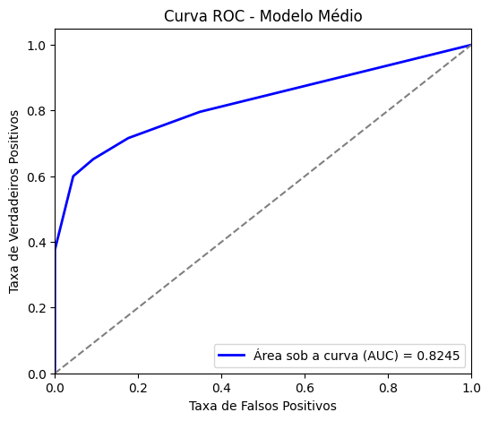

# Experimento B2
===== 📊 MÉTRICAS DO MODELO MÉDIO =====
- ✅ Accuracy: 0.7980
- ✅ Sensitivity (Recall): 0.7200
- ✅ Specificity: 0.8760
- ✅ Precision: 0.8531
- ✅ F1-score: 0.7809

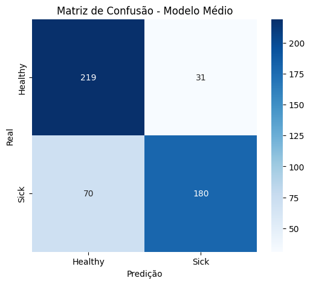
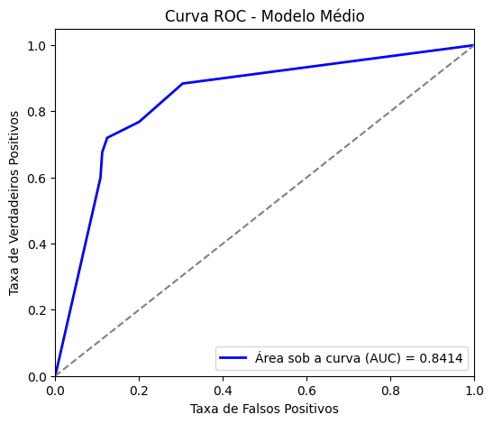

# Experimento C
===== 📊 MÉTRICAS DO MODELO MÉDIO =====
- ✅ Accuracy: 0.7880
- ✅ Sensitivity (Recall): 0.7040
- ✅ Specificity: 0.8720
- ✅ Precision: 0.8462
- ✅ F1-score: 0.7686
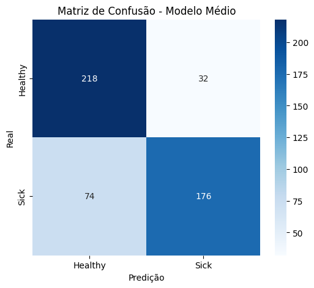
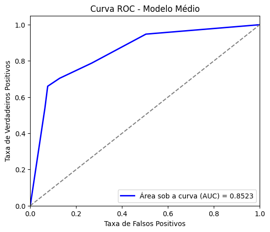

# Experimento C2
===== 📊 MÉTRICAS DO MODELO MÉDIO =====
- ✅ Accuracy: 0.8220
- ✅ Sensitivity (Recall): 0.7560
- ✅ Specificity: 0.8880
- ✅ Precision: 0.8710
- ✅ F1-score: 0.8094

# Experimento D
===== 📊 MÉTRICAS DO MODELO MÉDIO =====
- ✅ Accuracy: 0.7840
- ✅ Sensitivity (Recall): 0.6960
- ✅ Specificity: 0.8720
- ✅ Precision: 0.8447
- ✅ F1-score: 0.7632

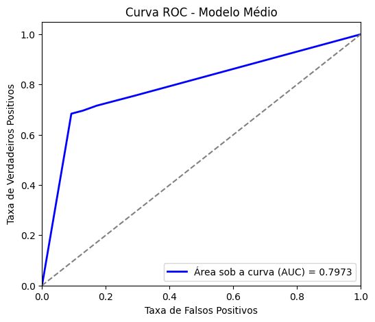

# Experimento D2
===== 📊 MÉTRICAS DO MODELO MÉDIO =====
- ✅ Accuracy: 0.8160
- ✅ Sensitivity (Recall): 0.7640
- ✅ Specificity: 0.8680
- ✅ Precision: 0.8527
- ✅ F1-score: 0.8059

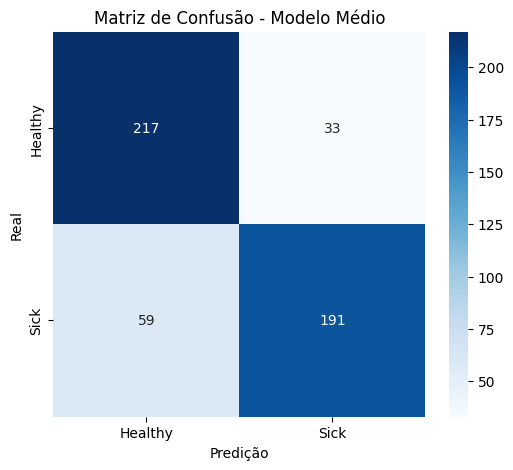
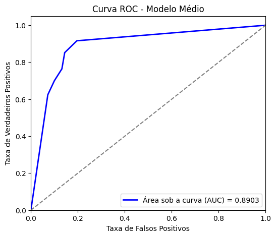
# Experimento E MELHOR
===== 📊 MÉTRICAS DO MODELO MÉDIO =====
- ✅ Accuracy: 0.8200
- ✅ Sensitivity (Recall): 0.7840
- ✅ Specificity: 0.8560
- ✅ Precision: 0.8448
- ✅ F1-score: 0.8133

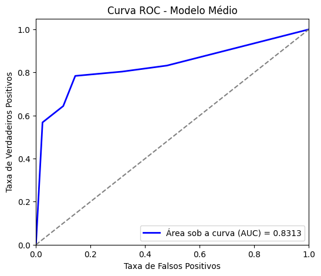
# Experimento E2
===== 📊 MÉTRICAS DO MODELO MÉDIO =====
- ✅ Accuracy: 0.8060
- ✅ Sensitivity (Recall): 0.7360
- ✅ Specificity: 0.8760
- ✅ Precision: 0.8558
- ✅ F1-score: 0.7914

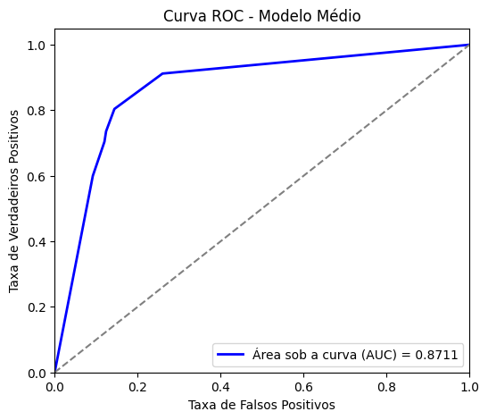