# Densenet121 Subnet 128
===== 📊 MÉTRICAS DO MODELO MÉDIO =====
- ✅ Accuracy: 0.9444
- ✅ Sensitivity (Recall): 1.0000
- ✅ Specificity: 0.8889
- ✅ Precision: 0.9000
- ✅ F1-score: 0.9474

# Densenet121 Subnet 1024
===== 📊 MÉTRICAS DO MODELO MÉDIO =====
- ✅ Accuracy: 0.9167
- ✅ Sensitivity (Recall): 1.0000
- ✅ Specificity: 0.8333
- ✅ Precision: 0.8571
- ✅ F1-score: 0.9231

# Densenet121E2Correto
===== 📊 MÉTRICAS DO MODELO MÉDIO ===== 
- ✅ Accuracy: 0.9778
- ✅ Sensitivity (Recall): 1.0000
- ✅ Specificity: 0.9630
- ✅ Precision: 0.9474
- ✅ F1-score: 0.9730

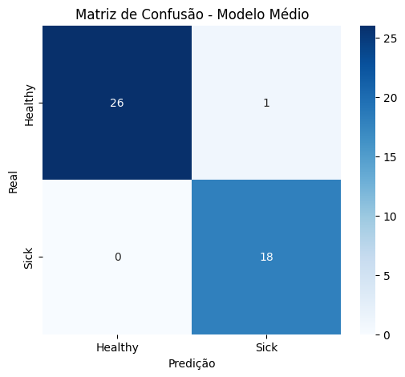
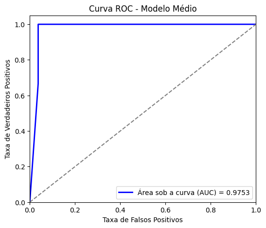

===== 📊 MÉTRICAS DO MELHOR MODELO =====
- ✅ Accuracy: 0.9556
- ✅ Sensitivity (Recall): 0.9444
- ✅ Specificity: 0.9630
- ✅ Precision: 0.9444
- ✅ F1-score: 0.9444

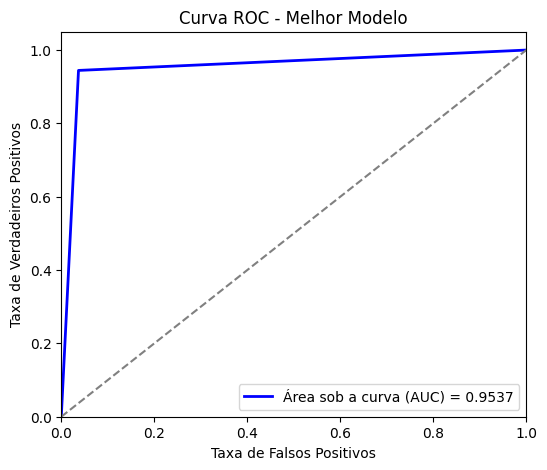

# Densenet121E2 ROC2
===== 📊 MÉTRICAS DO MODELO MÉDIO =====
✅ Accuracy: 0.9333
✅ Sensitivity (Recall): 1.0000
✅ Specificity: 0.8889
✅ Precision: 0.8571
✅ F1-score: 0.9231

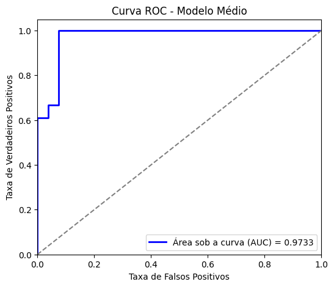

# Efficientnet
===== 📊 MÉTRICAS DO MODELO MÉDIO =====
- ✅ Accuracy: 0.8444
- ✅ Sensitivity (Recall): 0.6111
- ✅ Specificity: 1.0000
- ✅ Precision: 1.0000
- ✅ F1-score: 0.7586

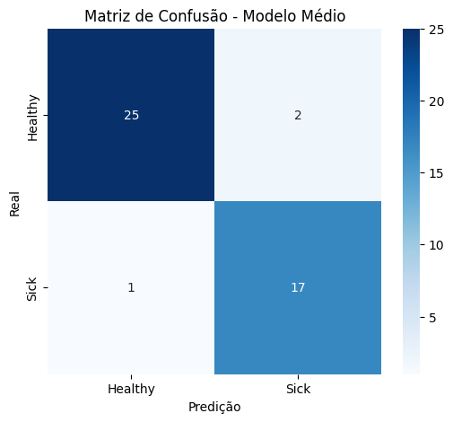
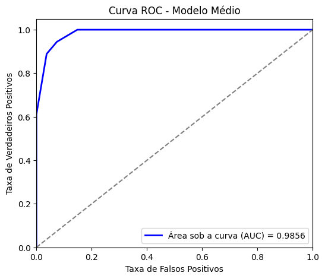

# Efficientnet Balanceada
===== 📊 MÉTRICAS DO MODELO MÉDIO =====
- ✅ Accuracy: 0.8889
- ✅ Sensitivity (Recall): 0.9444
- ✅ Specificity: 0.8333
- ✅ Precision: 0.8500
- ✅ F1-score: 0.8947

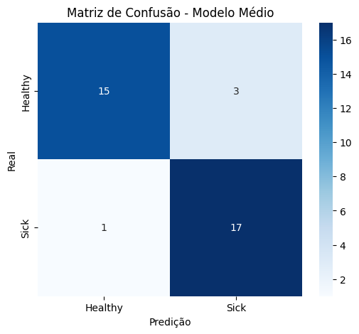
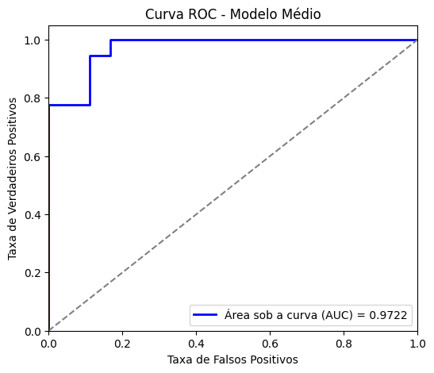

# Efficientnet Subnet 128
===== 📊 MÉTRICAS DO MODELO MÉDIO =====
- ✅ Accuracy: 0.9167
- ✅ Sensitivity (Recall): 0.9444
- ✅ Specificity: 0.8889
- ✅ Precision: 0.8947
- ✅ F1-score: 0.9189

# Resnet
===== 📊 MÉTRICAS DO MODELO MÉDIO =====
- ✅ Accuracy: 0.8444
- ✅ Sensitivity (Recall): 0.6111
- ✅ Specificity: 1.0000
- ✅ Precision: 1.0000
- ✅ F1-score: 0.7586

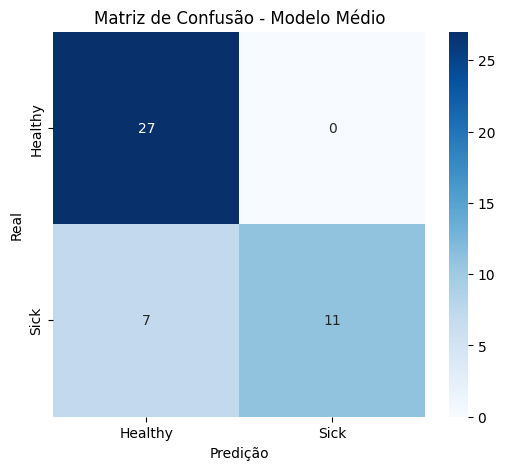
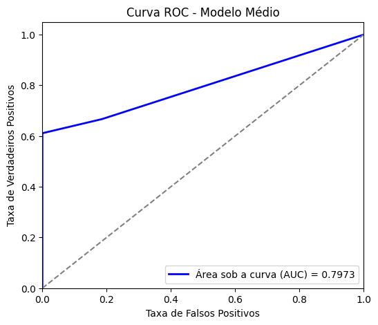

# Resnet ROC2
===== 📊 MÉTRICAS DO MODELO MÉDIO =====
- ✅ Accuracy: 0.8444
- ✅ Sensitivity (Recall): 0.6667
- ✅ Specificity: 0.9630
- ✅ Precision: 0.9231
- ✅ F1-score: 0.7742

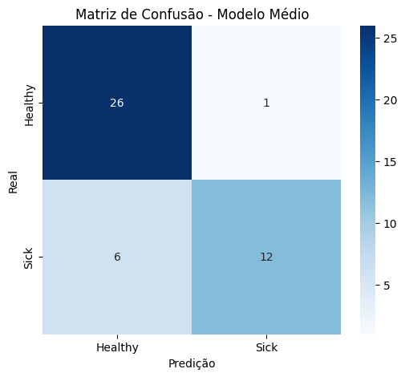
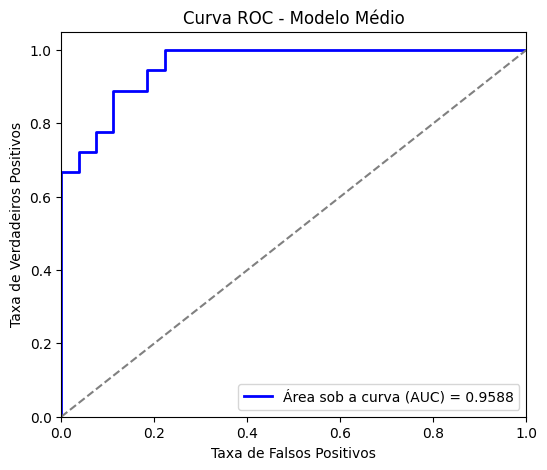

# Resnet Balanceada
===== 📊 MÉTRICAS DO MODELO MÉDIO =====
✅ Accuracy: 0.7778
✅ Sensitivity (Recall): 0.7222
✅ Specificity: 0.8333
✅ Precision: 0.8125
✅ F1-score: 0.7647

===== 📊 MÉTRICAS DO MODELO MÉDIO =====
- ✅ Accuracy: 0.8056
- ✅ Sensitivity (Recall): 0.7778
- ✅ Specificity: 0.8333
- ✅ Precision: 0.8235
- ✅ F1-score: 0.8000

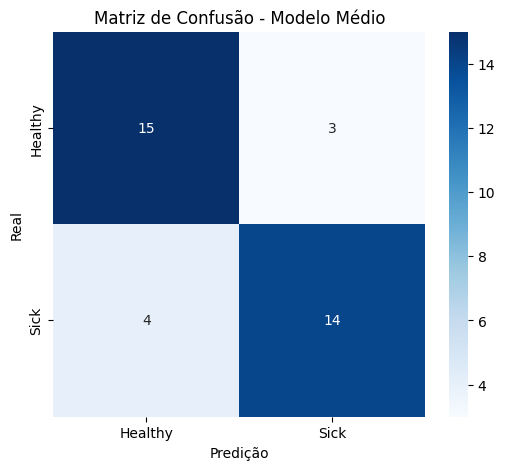
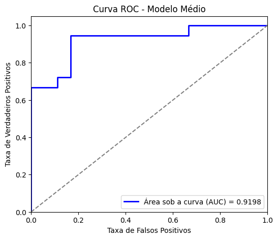

# Resnet Subnet 128
===== 📊 MÉTRICAS DO MODELO MÉDIO =====
- ✅ Accuracy: 0.8333
- ✅ Sensitivity (Recall): 0.7778
- ✅ Specificity: 0.8889
- ✅ Precision: 0.8750
- ✅ F1-score: 0.8235

